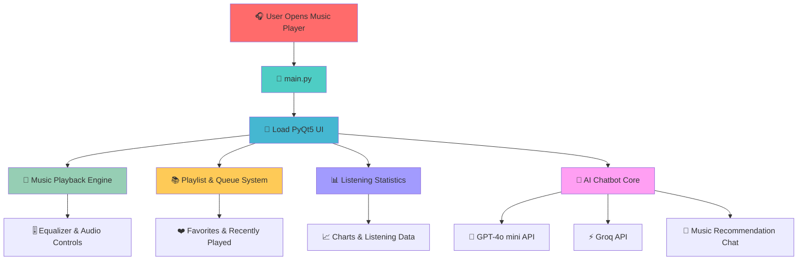
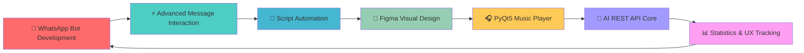

#  Hi, I'm **Redsilence.sfx**

<div align="center">
  
</div>

<br>

<div align="center">

[](https://git.io/typing-svg)

</div>

<div align="center">


</div>

---

<div align="center">

### ⚡ Script Developer · 🤖 Bot Automation Builder · 🎨 Visual Designer · 🧠 AI App Explorer

</div>

---

## 🧬 Developer Identity

```javascript
const redsilence = {
  name: "Redsilence.sfx",
  role: "Script Developer, Automation Builder, and Visual Designer",
  origin: "Started from WhatsApp bot scripting and advanced message interaction experiments",
  currentFocus: [
    "WhatsApp bot automation",
    "Advanced message workflow systems",
    "Figma-based visual design",
    "Futuristic Instagram display concepts",
    "PyQt5 desktop applications",
    "AI REST API integration"
  ],
  activeProject: "SoundWave Music Player v4.0",
  aiCore: ["GPT-4o mini", "Groq"],
  designDirection: "Clean, futuristic, aesthetic, modern, and functional",
  mindset: "Build systems that look sharp, work clearly, and feel intentional"
};
```

---

## 🚀 About Me

### 🧠 Who I Am

I am a script developer and digital creator focused on building automation tools, experimental interaction systems, clean interfaces, and practical digital products.

My journey started from WhatsApp bot scripting, where I explored uncommon message structures, interactive message behavior, and automation flows that are rarely used by regular users. That experience later evolved into freelance script development and custom bot-based solutions.

### 🤖 What I Build

I build WhatsApp bot scripts, automation workflows, message interaction systems, AI-integrated tools, and desktop applications with clean structure and practical usage.

I do not only focus on whether the system works. I also care about how the system feels, how the interface looks, and how the user experiences the product from start to finish.

### 🎨 Design Side

Outside scripting, I also work with Figma-based visual design, especially futuristic Instagram display concepts with clean layouts, premium spacing, modern typography, and strong visual identity.

For me, design is not decoration. Design is how a product communicates before the user even clicks anything.

### 🧠 Current Direction

Right now, I am developing a PyQt5-based music player with a modern interface and an AI-powered core system using GPT-4o mini and Groq REST APIs.

The goal is to build a music player that feels clean, intelligent, and visually sharp.

---

## 🛠️ Tech Arsenal

<div align="center">

### 💻 Programming & Scripting


<br><br>


---

### 🤖 Bot, Automation & API


<br><br>


---

### 🎨 Design & Interface


<br><br>


---

### 🖥️ Desktop App Development


---

### 🔧 Tools & Workflow


<br><br>


</div>

---

## 📊 GitHub Performance Dashboard

<div align="center">


</div>

<br>

<div align="center">


</div>

<br>

<div align="center">


</div>

<br>

<div align="center">


</div>

<br>

<div align="center">


</div>

<br>

<div align="center">


</div>

<br>

<div align="center">


</div>

---

## 🏆 Featured Project

<div align="center">

[](https://github.com/redsilence-sfx/music-player)

</div>

---

## 🎧 SoundWave Music Player v4.0

<div align="center">


</div>

### 🎵 Project Overview

**SoundWave Music Player v4.0** is a modern PyQt5-based music player designed with clean UI, smooth interaction, audio control features, and AI chatbot integration.

The project combines desktop music playback, visual interface design, playlist management, listening statistics, and AI-powered music interaction into one experimental application.

### ✨ Main Features

| Icon | Feature Area     | Description                                                                     |
| ---- | ---------------- | ------------------------------------------------------------------------------- |
| 🎨   | Modern UI/UX     | Clean interface, smooth animations, SVG icons, purple theme, responsive layout  |
| 🎵   | Audio Playback   | Support for MP3, WAV, OGG, and FLAC audio formats                               |
| 📚   | Queue & Playlist | Add, remove, reorder songs, create playlists, and manage music flow             |
| ❤️   | Favorites        | Mark favorite songs with SVG icon-based interaction                             |
| 🕘   | Recently Played  | Track listening history and recent song activity                                |
| 🔍   | Search System    | Fast search with real-time results                                              |
| 🎚️  | Audio Controls   | Equalizer, volume slider, seekable progress bar, shuffle, repeat, and shortcuts |
| 🧠   | AI Chat Core     | GPT-4o mini and Groq-based chatbot engines                                      |
| 📊   | Statistics       | Play count, listening time, top songs, and visual charts                        |
| 🌙   | Extra Features   | Lyrics display, sleep timer, mood colors, and drag & drop support               |

---

## 🧩 Music Player Project Structure

```bash
soundwave/
├── 📁 app/
│   ├── 🎧 player.py              # Main player class
│   ├── 🧰 helpers.py             # Helper functions
│   └── 📦 __init__.py
│
├── 📁 features/
│   ├── 📜 lyrics.py              # Lyrics display feature
│   ├── 📚 playlist.py            # Playlist manager
│   ├── 🎮 quiz.py                # Music quiz feature
│   ├── 🕘 recent.py              # Recently played tracker
│   ├── 🌙 sleep_timer.py         # Sleep timer system
│   ├── 📊 stats.py               # Listening statistics
│   ├── 🎨 theme.py               # Theme engine
│   └── 📦 __init__.py
│
├── 📁 widgets/
│   ├── 🎚️ equalizer.py           # Equalizer widget
│   └── 📦 __init__.py
│
├── 📁 rest api bot/
│   ├── 🔐 .env                   # API keys, keep private
│   └── 🧪 .env.example           # Environment template
│
├── 📁 icons/
│   └── 📁 svg/                   # SVG icon assets
│
├── 📁 images/                    # Image assets and visual resources
├── 📁 scripts/                   # Supporting scripts
│
├── 🧠 ai_chatbot.py              # GPT-4o mini chatbot engine
├── ⚡ ai_chatbot_v2.py           # Groq chatbot engine
├── ⚙️ constants.py               # Application constants
├── 🧾 logger.py                  # Console logger
├── 🚀 main.py                    # Main application entry point
├── 🛠️ running_system.py          # Auto-installer and launcher
├── 🎨 styles.css                 # Application stylesheet
├── 🖼️ music_player.ui            # Qt UI design file
├── 📊 stats.json                 # Listening statistics data
├── 🕘 history.json               # Listening history data
├── 📦 package-lock.json          # Package lock file
├── 🚫 .gitignore                 # Git ignore rules
└── 📘 README.md                  # Project documentation
```

---

## 🧠 Music Player System Flow

<div align="center">



</div>

---

## 🧪 AI Core System

### 🤖 GPT-4o Mini Engine

The first chatbot core is designed for lightweight AI conversation and music-related interaction. It supports simple assistant behavior inside the music player experience.

### ⚡ Groq Engine

The second chatbot core is built as an alternative AI engine using Groq API. This gives the application a second AI route for faster and more flexible chatbot responses.

### 🔐 API Configuration

The AI system uses environment-based configuration through `.env`, so sensitive API keys are not exposed directly in the repository.

---

## 🎯 Current Focus

<div align="center">



</div>

### 🔥 Development Priorities

* 🤖 Building cleaner WhatsApp bot automation systems
* ⚡ Improving advanced message interaction workflows
* 🧩 Structuring scripts into reusable and maintainable modules
* 🎨 Designing futuristic Instagram display visuals in Figma
* 🎧 Developing a clean PyQt5-based music player
* 🧠 Integrating AI chatbot systems through REST APIs
* 📊 Tracking project statistics and improving user experience
* 🚀 Building a stronger developer identity through polished GitHub presentation

---

## 💼 Freelance & Creative Work

### 🤖 WhatsApp Bot Customization

I work on custom bot scripts, automation commands, and message workflow systems for specific client needs.

### ⚡ Automation Scripts

I build practical scripts that help simplify repetitive tasks, improve interaction flow, and create unique digital experiences.

### 🎨 Figma Visual Design

I design futuristic Instagram displays, clean UI layouts, and modern digital visuals with strong visual identity.

### 🧠 AI-Integrated Products

I explore AI-powered systems using REST APIs, chatbot engines, and desktop application workflows.

---

## 🧭 Work Philosophy

| Icon | Principle              | Meaning                                                            |
| ---- | ---------------------- | ------------------------------------------------------------------ |
| 🎯   | Purpose First          | Every feature should have a clear reason to exist                  |
| 🧼   | Clean Execution        | A good system should be readable, structured, and easy to maintain |
| 🎨   | Strong Visual Identity | Design should make the product feel intentional                    |
| ⚡    | Practical Automation   | Automation should solve real workflow problems                     |
| 🧠   | Smart Integration      | AI should improve the product, not just decorate it                |
| 🚀   | Continuous Improvement | Every version should be sharper than the previous one              |

---

## 🌐 Connect with Me

<div align="center">

<a href="https://github.com/redsilence-sfx">
  
</a>
<a href="https://t.me/bravo6core">
  
</a>
<a href="https://t.me/travassuperrior">
  
</a>
<a href="mailto:redsilence@gmail.com">
  
</a>

</div>

---

## 💡 Quick Facts

<div align="center">

| ⚡ Area           | 🧩 Detail                                                |
| ---------------- | -------------------------------------------------------- |
| Main Identity    | Script Developer & Visual Designer                       |
| Main Specialty   | WhatsApp bot automation and advanced message interaction |
| Design Direction | Futuristic, clean, aesthetic, and modern                 |
| Current Project  | SoundWave Music Player v4.0                              |
| AI Stack         | GPT-4o mini and Groq                                     |
| Main Language    | Python and JavaScript                                    |
| Interface Focus  | PyQt5 desktop UI and Figma visual design                 |
| Work Style       | Experimental, structured, and visually polished          |

</div>

---

## 🐍 Contribution Snake

<div align="center">


</div>

---

## 🌊 Footer

<div align="center">
  
</div>

<div align="center">

### ⭐ If you like my work, consider giving a star to my repositories.

</div>

<div align="center">
  <sub>💖 Built with focus, style, and clean execution by Redsilence.sfx · Last updated: 2026</sub>
</div>
