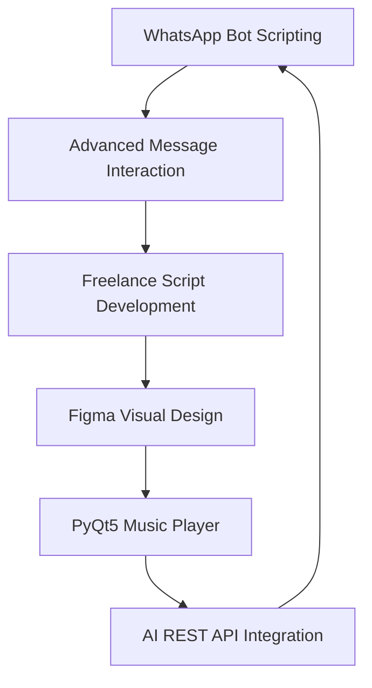

# Hi, I'm Redsilence.sfx

<p align="center">
  
</p>

<p align="center">
  <b>Script Developer · WhatsApp Automation Specialist · UI/UX Visual Designer · AI-Integrated App Builder</b>
</p>

<p align="center">
  I build experimental scripts, automation tools, clean user interfaces, and modern digital products with a strong focus on visual identity, interaction flow, and practical usability.
</p>

<p align="center">
  
  
  
</p>

---

## About Me

I'm a self-driven developer and digital creator focused on building tools that combine automation, design, and experimental interaction systems.

My main background started from WhatsApp bot scripting, where I explored uncommon message structures, automation behavior, and interactive message workflows that are rarely used by regular users. Over time, that experience grew into freelance work, script development, and custom digital solutions.

Besides scripting, I also work with visual design, especially Figma-based Instagram display concepts with futuristic, clean, and aesthetic layouts. I enjoy creating designs that feel modern, sharp, and visually memorable without looking messy or overdecorated.

Currently, I'm also developing a PyQt5-based music player with a clean modern interface and a core system powered by two chatbot REST APIs: GPT-4o mini and Groq. The goal is to create a desktop application that feels smooth, practical, and intelligent.

---

## What I Do

```javascript
const redsilence = {
  name: "Redsilence.sfx",
  role: "Script Developer & Digital Product Designer",
  focus: [
    "WhatsApp Bot Automation",
    "Advanced Message Interaction",
    "Figma UI/UX Design",
    "Modern Instagram Display Design",
    "PyQt5 Desktop Applications",
    "AI REST API Integration"
  ],
  currentProject: "AI-powered music player with GPT-4o mini and Groq integration",
  style: "Clean, modern, experimental, and functional",
  mindset: "Build useful systems with strong visual identity"
};
```

---

## Core Skills

<p align="center">
  
  
  
  
  
  
  
</p>

---

## Main Areas

### WhatsApp Bot & Script Development

I develop automation scripts and bot systems focused on message behavior, interaction flow, and custom command handling. My work explores advanced WhatsApp message formats and bot-side logic to create unique user experiences.

Main focus:

* WhatsApp bot scripting
* Custom command systems
* Message interaction workflows
* Automation-based utilities
* Experimental message format handling
* Freelance script customization

---

### UI/UX & Figma Design

I design modern visual layouts with a strong focus on aesthetic structure, spacing, typography, and futuristic interface direction. My design work is especially focused on Instagram display concepts, digital branding, and clean presentation layouts.

Design focus:

* Instagram display design
* Futuristic visual style
* Figma-based UI exploration
* Clean and modern layout systems
* Social media visual identity
* Aesthetic digital presentation

---

### AI-Powered Desktop Application

I'm currently building a modern music player using PyQt5 with a clean interface and AI-powered core system. The app integrates chatbot REST APIs such as GPT-4o mini and Groq to create a smarter and more interactive desktop experience.

Project direction:

* PyQt5 music player
* Clean desktop UI
* AI chatbot REST API integration
* GPT-4o mini support
* Groq API support
* Modular core system design

---

## Featured Project

### Music Player with AI Core

A clean and modern PyQt5-based music player designed with an integrated AI chatbot system powered by GPT-4o mini and Groq REST APIs.

Repository:

[Music Player Repository](https://github.com/redsilence-sfx/music-player.git)

Main features:

* Modern desktop interface
* Music player functionality
* AI chatbot integration
* REST API-based core system
* Clean UI structure
* Experimental assistant workflow

---

## GitHub Stats

<p align="center">
  
  
</p>

<p align="center">
  
</p>

---

## Current Focus



Right now, I'm focused on improving my scripting structure, building cleaner user interfaces, and developing AI-integrated applications that combine automation, design, and practical functionality.

---

## Work Philosophy

I care about building things that are not only functional, but also visually strong and easy to understand. A good product should not feel complicated just to look advanced. It should work clearly, look intentional, and solve a real use case.

My approach is simple:

* Build with purpose
* Keep the interface clean
* Make the system practical
* Experiment with uncommon ideas
* Improve the product through iteration
* Avoid unnecessary complexity

---

## Connect with Me

<p align="center">
  <a href="https://github.com/redsilence-sfx">
    
  </a>
  <a href="https://t.me/bravo6core">
    
  </a>
  <a href="mailto:your-email@example.com">
    
  </a>
</p>

---

<p align="center">
  <b>Building scripts, interfaces, and experimental systems with clean execution.</b>
</p>

<p align="center">
  <sub>Last updated: 2026</sub>
</p>
